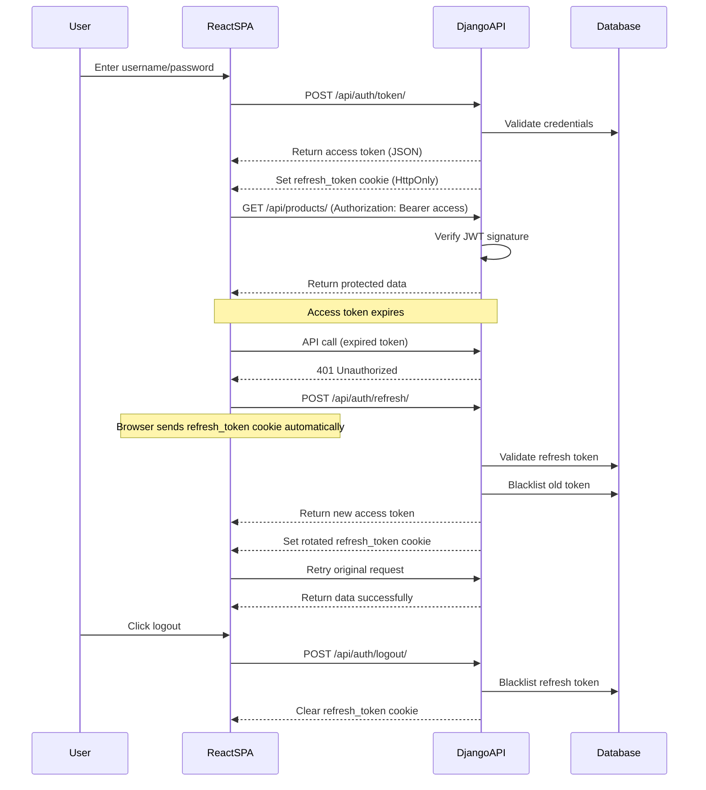

# FRONT2BACK_API_FLOW_DIAGRAM.md

```mermaid
sequenceDiagram
    participant User
    participant ReactSPA
    participant DjangoAPI
    participant Database

    User->>ReactSPA: Enter username/password
    ReactSPA->>DjangoAPI: POST /api/auth/token/
    DjangoAPI->>Database: Validate credentials
    DjangoAPI-->>ReactSPA: Return access token (JSON)
    DjangoAPI-->>ReactSPA: Set refresh_token cookie (HttpOnly)

    ReactSPA->>DjangoAPI: GET /api/products/ (Authorization: Bearer access)
    DjangoAPI->>DjangoAPI: Verify JWT signature
    DjangoAPI-->>ReactSPA: Return protected data

    Note over ReactSPA,DjangoAPI: Access token expires

    ReactSPA->>DjangoAPI: API call (expired token)
    DjangoAPI-->>ReactSPA: 401 Unauthorized

    ReactSPA->>DjangoAPI: POST /api/auth/refresh/
    Note over ReactSPA: Browser sends refresh_token cookie automatically
    DjangoAPI->>Database: Validate refresh token
    DjangoAPI->>Database: Blacklist old token
    DjangoAPI-->>ReactSPA: Return new access token
    DjangoAPI-->>ReactSPA: Set rotated refresh_token cookie

    ReactSPA->>DjangoAPI: Retry original request
    DjangoAPI-->>ReactSPA: Return data successfully

    User->>ReactSPA: Click logout
    ReactSPA->>DjangoAPI: POST /api/auth/logout/
    DjangoAPI->>Database: Blacklist refresh token
    DjangoAPI-->>ReactSPA: Clear refresh_token cookie
```
