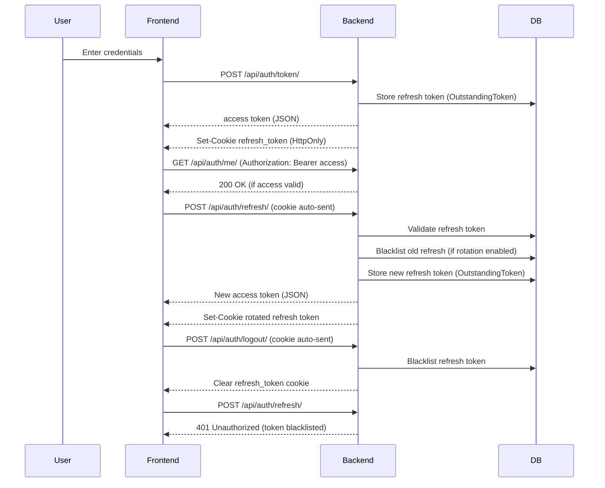

# JWT Authentication Lifecycle (Hybrid Strategy)

This diagram documents the Phase 1 authentication model implemented in
this system:

-   Access Token (short-lived, not stored)
-   Refresh Token (HttpOnly cookie, stored + blacklistable)
-   Rotation + Blacklist enabled

------------------------------------------------------------------------

## Mermaid Diagram

------------------------------------------------------------------------

## Key Concepts

### 1. Access Tokens

-   Short lifetime (e.g., 10 minutes)
-   Never stored in database
-   Cannot be revoked directly
-   Stateless

### 2. Refresh Tokens

-   Stored in `OutstandingToken`
-   Can be blacklisted
-   Rotated on refresh
-   Represent the logical "session"

### 3. Blacklisted Tokens

-   Stored in `BlacklistedToken`
-   Remain in Outstanding table (by design)
-   Marked invalid for future use

------------------------------------------------------------------------

## Important Clarifications

-   Multiple logins = multiple refresh tokens.
-   Each refresh token is a session.
-   Logout blacklists only the current refresh token.
-   Access tokens remain valid until expiration (by design).
-   Blacklisted tokens are not deleted --- they are marked invalid.

------------------------------------------------------------------------

## Phase 2 Evolution

In Phase 2, this model may evolve to:

-   Authorization Code Flow with PKCE
-   Shorter access lifetimes
-   Device/session management UI
-   MFA integration
-   Session limits per user

This diagram represents the current Phase 1 hybrid JWT strategy.
