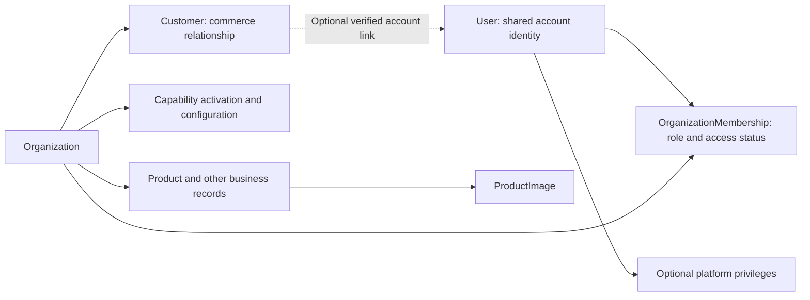

# Commerce Architect Operator Experience and Authorization

**Status:** Working draft, revision 2. Under review; not authoritative project
documentation or implementation authority. No runtime changes are authorized.

**Date:** 2026-09-10

**Repository baseline:** `f1648dff47c0606fc78d11f42fb2eac10fa8c36e` on `develop`.

The existing `codex/operator-experience-authorization-design` branch remains
unmerged. All artifacts from this exercise belong in this draft folder. The
[decision record](DECISIONS.md) records alternatives, selected recommendations,
and remaining human input. “Selected” means resolved within this draft, not
approved for implementation or promotion into authoritative documentation.
The [storefront and first-operator refinement](STOREFRONT_CAPABILITIES_AND_FIRST_OPERATOR_EXPERIENCE.md)
defines how the current public Product list becomes one optional capability
section and how the initial Owner controls it.

## 1. Recommended direction

Commerce Architect should use one account identity, with independent platform
privileges, Organization memberships, and commerce relationships. A person
enters an experience in a specific context; they do not have one global business
“user type.”

- Organization remains the root of business ownership, configuration, and access
  scope. Shared account identity does not make business records global.
- OrganizationMembership grants the right to operate an Organization through
  named permissions. Customer records describe commerce relationships.
- Django Admin remains a technical administration surface. Organization owners
  and staff use a purpose-built operator application.
- Authorization combines identity, the applicable privilege or membership,
  permissions, Organization capability state, resource ownership, and operation
  rules. Every required condition must pass on the backend.
- Capability availability, Organization activation, storefront exposure, and
  permission to perform an action are distinct decisions.
- Use the existing React application and Django modular monolith. Start with
  fixed roles and explicit permission mappings, without a separate policy
  service, generic rules engine, or custom-role designer.

All roles, routes, permission names, and workflows below are draft decisions
unless specifically identified as current implementation. This exercise defines
boundaries and major areas, not screen layouts or API/schema specifications.

## 2. Current implementation versus design context

The exercise describes OrganizationMembership, Customer, and capability
foundations. This checkout contains some of those foundations but does not
contain OrganizationMembership or Customer models, or persisted per-Organization
capability activation. Treat those concepts as architectural inputs and
reconcile any work on other branches before implementation; do not assume their
fields or migrations from this proposal.

| Area | Evidence in this checkout | Implication |
| --- | --- | --- |
| Identity | Stock Django User, account profile, verification, recovery, JWT API authentication in [accounts](../../../backend/accounts/models.py) and [authentication architecture](../../USERAUTH_ARCHITECTURE.md) | Keep identity independent of commerce. `/api/auth/me/` currently provides identity, not operator entitlements. |
| Organization | [Organization](../../../backend/organizations/models.py) has name and active/inactive status; [its Admin](../../../backend/organizations/admin.py) requires an active superuser | Organization status is not a Product Commerce enable switch. Membership and delegated access remain a gap here. |
| Product Commerce | [Product and ProductImage](../../../backend/catalog/models.py) have Organization ownership through Product; [catalog services](../../../backend/catalog/services.py) scope data and coordinate catalog writes | Ownership and locking provide foundations, not user authorization. |
| Public catalog | [Product list](../../../backend/catalog/views.py) uses `STOREFRONT_ORGANIZATION_ID` and active physical products | One configured public storefront exists. Neither a tenant chooser nor a capability/presentation gate exists here. |
| Product images | [Verification](../../../backend/catalog/media.py), immutable storage, and export readback exist. [ProductImage Admin](../../../backend/catalog/admin.py) blocks creation, restricts access to active superusers, and makes the storage key read-only | Metadata/primary changes and association deletion exist in Admin; a native upload API/UI and storefront image presentation do not. |
| Product Admin | [ProductAdmin](../../../backend/catalog/admin.py) scopes to the configured storefront but uses ordinary Django model permissions for access, unlike Organization and ProductImage Admin | The current Admin policy is not uniform and is not an OrganizationMembership authorization system. |
| Browser experience | [App](../../../frontend/src/App.tsx) combines authentication/account panels with product browsing | Login currently closes the authentication panel; it does not select an operator workspace. |

The [platform philosophy](../../PLATFORM_PHILOSOPHY.md),
[frontend direction](../../UX_ARCHITECTURE.md), and
[catalog media contract](../../CATALOG_PORTABILITY.md#verified-immutable-media-boundary)
remain governing context. This proposal supplements current runtime documents;
it does not claim the target behavior is already available.

## 3. Identity and human roles

An authentication identity answers **who is making the request**. Authorization
answers **what this identity may do here**. A commerce relationship answers
**how someone participates in this Organization's business**.

| Human description | Architectural classification | Recommended surface |
| --- | --- | --- |
| Django/platform superuser | A User with exceptional platform authorization through `is_superuser`; not another identity class or an Organization owner | Deliberate technical Admin access for bootstrap and recovery; normal application access uses the applicable application policy |
| Platform technical operator / administrator | A User with explicitly assigned platform permissions; normally not a superuser | Django Admin for approved technical tasks; infrastructure tooling where appropriate |
| Organization owner | An OrganizationMembership role with Organization governance authority; does not itself prove legal ownership or identify the payer | Organization operator application |
| Organization administrator | An OrganizationMembership role for delegated administration within that Organization | Organization operator application |
| Organization manager | An OrganizationMembership role for defined daily operational responsibilities | Permitted operator areas |
| Organization staff / employee | “Staff” is an OrganizationMembership role; employment is a separate business fact if the product needs to record it | A restricted operator workspace |
| Registered authenticated customer/member who is not an employee | A User, optionally linked to an Organization's Customer and/or a separate customer membership/subscription relationship | Personal account and Organization-specific customer/member self-service |
| Guest customer | An unauthenticated commerce participant, potentially represented by a Customer and transaction records without a User link | Public storefront and explicitly supported guest journeys |

Django's `is_staff` controls Admin eligibility; it does not mean Organization
employee. `is_superuser` supplies broad Django permission authority, while
`is_authenticated` alone grants no business permission. These are framework
facts, not the proposed Organization role model.
[Django User reference](https://docs.djangoproject.com/en/6.0/ref/contrib/auth/).

Use qualified language in the UI and documentation: **Platform administrator**,
**Organization administrator**, **Team member**, and **Customer member**. Avoid
an unqualified “admin” or “member” where the distinction matters.

### Independent relationships

One person can own Organization A, work as staff in Organization B, and buy from
both. Their memberships are evaluated independently; their Customer records do
not union those privileges. A platform operator may also have an ordinary
Organization membership, but must act under an explicit context.

Customer should remain Organization-owned with an optional account link. An
account may have customer relationships with several Organizations, and an
account may exist before any Customer record. Do not create Organization access
on registration, purchase, customer creation, or a matching email address.

**Selected cardinality:** initially, at most one Customer directly linked to a
given User in a given Organization. A Customer links to zero or one User. Many
unlinked guest Customer records may exist, including apparent duplicates. This
gives self-service one clear relationship without creating household, company,
or delegated-payer access through duplicate account links. If an adopter needs
those relationships, design them explicitly before imposing this constraint on
existing data; they are not a reason to grant operator membership.

Registration creates only the account. The first qualifying commerce action may
create or reuse its Organization-scoped Customer through a concurrency-safe
service; no Customer is required merely to log in. Names, contact information,
and transaction snapshots retain their domain meanings and do not synchronize
automatically from the account profile.

“Customer member” may mean a registered account, loyalty participant, subscriber,
or club member. Where it has business meaning, represent its entitlement in the
owning commerce capability. Do not store it as a staff OrganizationMembership.
An entitlement may authorize member content or benefits without granting
operator permissions.

Payer, purchaser, recipient, service provider, and employee are contextual
commercial or workforce relationships. They are not platform roles. A provider
who needs to manage their own appointments requires a defined scoped workflow;
the provider relationship alone must not grant Organization-wide scheduling
administration. A worker without a login need not have an active membership.

Customer self-service uses the authenticated link to the relevant Customer and
resource, not an operator membership. Guest order access will require a separate,
bounded proof-of-access design. Knowing an email address, Customer ID, or order
number is insufficient. Linking historical guest activity to an account requires
verified control and a deliberate reconciliation policy; it is not automatic
from email equality. Account profile edits also must not rewrite transaction
snapshots or another Organization's customer data.

For a future guest claim, require authenticated account control plus an expiring,
single-use proof bound to the specific guest transaction or relationship. An
email verification badge or an email match alone does not prove authority over
historical purchases. Consume proof atomically and reject claims already bound
to another account. Proof for one transaction must not unlock every record using
the same email or a shared guest Customer. Where the proof cannot safely establish
the whole Customer relationship, defer linking rather than broaden its scope.

If an account already has a Customer in that Organization, do not attach a second
Customer or silently merge it. Keep the duplicate unlinked and require a reviewed
reconciliation workflow. Preserve original record identities, transaction
snapshots, and an audit of any later relationship correction. Automatic fuzzy
deduplication and a general merge/alias system are outside the first release.

## 4. OrganizationMembership and roles

OrganizationMembership is the access relationship between one User and one
Organization. It can represent owners, employees, or an invited external
consultant. It is not an employment record and is not a Customer record.

Use one retained membership per User/Organization pair and one base role.
Invitation intent is separate from active membership so an email address need
not be represented by a placeholder User. Membership status and account status
are independent; both must permit access.

### Membership lifecycle

| State / transition | Selected policy |
| --- | --- |
| Invitation pending | Store Organization, intended normalized email, proposed role, inviter, expiry, and a token digest. No operator rights. Prefer a seven-day expiry initially; resend rotates the token and expiry. |
| Acceptance | Require a signed-in active User whose current verified email matches the invitation, possession of its valid token, and explicit acceptance. Recheck the inviter's current membership and authority to grant that role. Consume atomically and create/reactivate the unique membership. |
| Active | Grants only the role's explicit permissions in that Organization. An invitation cannot change an already active member's role; use the role-change operation. |
| Suspended | Access stops immediately; role and history remain. An authorized membership administrator may explicitly resume it after checking current assignment limits. An invitation cannot bypass suspension. |
| Revoked | Access ends; history remains. Rejoining requires a new invitation and acceptance, reusing the membership identity with a newly authorized role. No one-click resume of revoked access. |
| Expired, cancelled, or consumed invitation | No acceptance and no membership authority. Reissue is a new intent. Cancel pending invitations when their issuer loses the required grant authority; acceptance rechecks even if cancellation was delayed. |

Allow at most one live pending invitation per Organization/intended email; do
not silently overwrite it with a different role. Accepting from the wrong
account offers account switching and reveals no target member directory. Do not
auto-create or auto-verify a User, expose whether an arbitrary email already has
an account, or retroactively move memberships when account email changes.
Membership is bound to User identity after acceptance, not continuously to email.

Invitations initially offer Administrator, Manager, or Staff within the issuer's
assignment authority. Becoming Owner is a separate accepted governance operation
for an existing active member. External consultants follow the same lifecycle;
no employee flag or Customer record is required. Automatic contract-expiry access
and workforce records can be added when there is a concrete requirement.

Start with four fixed roles. Define each as an explicit set of permissions,
rather than numerical levels or scattered checks such as “manager or above.”
New capabilities must explicitly decide which roles receive each permission.
Do not give existing roles a wildcard that grants every future permission.

| Role | Recommended responsibility |
| --- | --- |
| Owner | Organization governance, ownership changes, appointment of administrators, and explicitly mapped business administration |
| Administrator | Business settings, capabilities, and team administration below the owner/admin boundary, plus explicitly mapped operational permissions |
| Manager | Daily catalog work initially; later domain duties need explicit grants. No automatic team administration, capability activation, or money movement |
| Staff | A small operational baseline; additional responsibilities only through a deliberately supported assignment model |

The following is the selected initial mapping. “Yes” still requires the correct
Organization, account eligibility, capability state, and resource conditions.
Names identify intended domain actions; this is not a migration instruction.

| Permission | Owner | Administrator | Manager | Staff |
| --- | --- | --- | --- | --- |
| `organization.view` (basic workspace identity/status) | Yes | Yes | Yes | Yes |
| `organization.settings.view`, `organization.settings.edit` | Yes | Yes | No | No |
| `organization.members.view` | Yes | Yes | No | No |
| `organization.members.invite`, `organization.members.manage` (Manager/Staff targets only) | Yes | Yes | No | No |
| `organization.members.leave` (own membership only; last-owner guard) | Yes | Yes | Yes | Yes |
| `organization.administrators.manage` (also required to invite an Administrator) | Yes | No | No | No |
| `organization.ownership.manage` | Yes | No | No | No |
| `organization.capabilities.view`, `organization.capabilities.manage` | Yes | Yes | No | No |
| `product_commerce.products.view` | Yes | Yes | Yes | Yes |
| `product_commerce.products.edit` | Yes | Yes | Yes | No |
| `product_commerce.images.manage` | Yes | Yes | Yes | No |
| `product_commerce.presentation.manage` | Yes | Yes | No | No |

`products.edit` covers approved catalog fields and per-product active/inactive
status, not stock adjustment, Organization ownership changes, bulk import/reset,
or raw media references. Product creation must satisfy required stock fields
through a domain-defined initial value; it must not smuggle an inventory
adjustment into catalog editing. `images.manage` requires scoped product read
access but does not require permission to edit price or enable public exposure.

Staff initially has read access to basic workspace information and catalog only.
This is a deliberate safe baseline, not a claim to support every employee task.
Keep the four roles without permission bundles or per-person overrides in the
first release. If a real assistant needs images without a Manager's broader
catalog authority, review a fixed role/profile change before granting access;
do not promote them merely to bypass the missing fit. That business need is not
established by this repository.

Future Customer, Orders, Payments, Inventory, and Scheduling permissions are
listed in section 6 to preserve separation, but are **unassigned and unavailable
initially for every role, including Owner**. Assign them explicitly when the
domain's workflow, data sensitivity, and adopter duties are reviewed. This
refines revision 1, whose provisional money-movement and customer-data grants
could silently become policy for domains that do not yet exist.

Membership management is itself privileged. An administrator cannot grant owner
or administrator, alter another owner/admin membership, or change their own role.
The self-only leave action is a distinct permission, not team administration.
Any later delegation bundles need an explicit assignable set; “manage team” must
not mean “grant any permission.” Reject forged role/permission fields on the
backend.

### Ownership governance

Select multiple equally trusted owners, with no primary-owner flag or quorum
engine. Any active, eligible owner may initiate an owner grant or remove another
owner, subject to recent authentication, audit, and the last-owner rule. Owner
is application governance authority, not a legal title or billing identity.
Organizations needing joint consent require a later explicit governance policy;
do not claim equal owners provide protection from a malicious co-owner.

An **active owner** is an active Owner membership linked to an active User.
Normal membership changes must leave at least one active owner. Invitations and
ownership offers do not count. Temporary lack of a verified current email or
recent authentication blocks operator actions but does not delete ownership or
count as a voluntary resignation.

| Operation | Selected policy |
| --- | --- |
| Bootstrap | A trusted platform procedure explicitly selects the Organization and first User; that active, verified User accepts the ownership offer. Normal operator access remains unavailable until an active owner exists. No first-login election or automatic ownership from superuser status. |
| Add co-owner | An eligible owner offers ownership to an existing active, verified member. The recipient explicitly accepts. Check the initiating owner's current authority, target eligibility, and offer validity at commit. Use an expiring, single-use offer. |
| Transfer | A specific ownership offer records the initiator's intended post-transfer role or revocation. Recipient acceptance promotes them and changes the initiator atomically. Until acceptance, the initiator stays owner; expiry/cancellation changes neither role. Adding a co-owner alone does not demote anyone. |
| Remove/suspend/demote owner | Owner-only, recently authenticated action; another owner's consent is not required. Never remove the final active owner through routine operations. Administrators cannot perform these operations. |
| Self-demotion or leaving | Owner may do so only if another active owner remains. Other active members may leave through the self-only leave permission, revoking their own membership without team-management authority; this cannot grant privileges. |
| Recovery | Try normal account recovery first. If no active owner can recover, use an explicit superuser procedure with independently established authority, target User, reason, and audit. Do not appoint a claimant solely from email, domain control, payer status, or a support ticket. |

Serialize owner and membership changes for an Organization and recheck under
the same transaction. Routine account deactivation/deletion must consider every
Organization in which the account is a last owner. A security suspension may
override availability: block the compromised User immediately, retain ownership
history, and require recovery rather than bypassing account checks. If this
leaves no active owner, deny normal operator access until recovery. It does not
silently rewrite storefront/capability settings; any public suspension is a
separate explicit platform action. Keep account recovery/verification reachable.

The same governance rule must cover technical Admin actions, not just the
operator UI. Removing employment access preserves the account and independent
Customer relationships. Recovery evidence and who may adjudicate ownership
disputes require a human policy before recovery is offered as a service.

## 5. Authorization evaluation and enforcement

The requested operation determines which policy applies. Public browsing,
customer self-service, Organization operation, and platform administration are
separate authorization paths; membership is mandatory for the Organization
operator path, not for every human interaction.

For an Organization operation, use this evaluation sequence:

1. **User:** validate authentication and current account eligibility. Require
   verified current email for operator access; recovery and verification routes
   must remain reachable. Do not rely only on a client flag or token role claim.
2. **Platform privilege, if any:** recognize it without silently applying it.
   Ordinary operator endpoints require membership even for a superuser. An
   explicitly designated platform operation uses its separate platform policy.
3. **OrganizationMembership:** resolve the explicit Organization and active
   membership and confirm an active owner exists. Check Organization status.
   Never select a default Organization as a substitute for missing membership.
4. **Role / permissions:** resolve the active membership's named permissions and
   require the exact action. View, edit, export, invite, and refund are separate
   decisions, even when they concern the same model.
5. **Enabled Organization capabilities:** apply the owning capability's policy
   for this operation, including the disabled-state exceptions in section 6.
   Organization governance actions have no Product Commerce dependency.
6. **Operation and resource:** require matching Organization ownership through
   the full relationship chain, appropriate workflow state, and all domain
   invariants. A permission does not make an invalid operation valid.

Unknown permissions/capabilities, missing scope, and incomplete policy fail
closed. Operator navigation reflects these results; it is not an access barrier.

Resolve list queries within the authorized Organization before serialization.
Apply the same scope to search, counts, dashboards, exports, related-field
choices, bulk actions, and nested resources. On writes, verify each supplied
product, image, customer, order, or membership belongs to that Organization.
Changing a route ID, form field, or parent ID cannot move a resource or expand
access. An inaccessible resource should not reveal another Organization's data
through error details.

Use a small shared Organization authorization policy with capability-owned
permission definitions and domain services. APIs and any permitted Admin
business actions call those services. Storage adapters neither decide business
authority nor infer it from possession of a storage key. Trusted commands have
an explicit installation-operator trust boundary; a supplied `--user` value
would not authenticate their caller.

Default Django permissions and global User groups are useful for technical
Admin access. They are not sufficient Organization scoping: the default
`ModelBackend` does not implement object-specific permission grants. Do not
interpret global `catalog.change_product` as “edit products in this membership's
Organization.” Use the explicit Organization policy, and avoid its accidental
short-circuit through Django's superuser permission behavior.
[Django authentication backend reference](https://docs.djangoproject.com/en/6.0/ref/contrib/auth/#django.contrib.auth.backends.ModelBackend).

Read current account security generation, membership, permissions, and capability
state on protected operator requests. Their revocation must not wait for the
ten-minute access-token expiry. A frontend access snapshot helps rendering but
is not authoritative. Avoid persistent
authorization caches initially. For uploads or other long operations, recheck
authorization and capability state at the final mutation; coordinate concurrent
revocation and capability changes at the transaction boundary.

Record sensitive operator actions with the real actor, Organization, action,
target, outcome, time, request/operation identifier, and relevant before/after
changes. Include membership, capability, media, and future refund changes.
Platform interventions require an
explicit reason and target. Django Admin's own log is not a complete audit trail
for API operations. Do not put credentials, verification tokens, or full payment
payloads in audit records. Write a successful database mutation and its audit
event atomically; business operators cannot edit or delete that history. Record
bounded failed/denied attempts in security logs. Log sensitive merchant-data
reads and exports by platform support as well as its mutations. Default audit
viewing to Owner and explicitly authorized platform personnel; audit export and
retention are separate policy decisions, not implied by team-management access.

### Operator authentication requirements

Verified current email is mandatory for every operator request, independently
of the deployment's optional credential-login verification flag. A changed
email immediately gates operator access while verification and personal account
recovery remain available; memberships and Customer links remain intact.

Use current User eligibility and compare the access token's security generation
with the account's current generation. A pre-recovery or pre-password-change
access token must not authorize operator requests even though the current
general authentication contract allows its remaining short lifetime. This is a
future operator policy prerequisite, not a claim that global token behavior was
changed. Existing legacy generation-zero compatibility needs an explicit
rollout decision; it must not bypass verified-email checks.

| Operation class | Selected requirement for its future release |
| --- | --- |
| Catalog read/edit and product images | Active verified account, current security generation, active scoped membership, exact permission; no repeated password prompt for routine work |
| Team invitation, resumption, revocation, or role change; capability activation; public exposure changes | Recent credential authentication as well as ordinary authorization |
| Ownership grant/transfer/removal; future bulk import/reset, sensitive data export, refunds, and platform privilege/recovery actions | Recent authentication; require MFA before offering these high-impact operations as delegated production self-service |

Select a five-minute maximum age for recent authentication initially. It is a
server-verified authentication event bound to the actor, live session/security
generation, and the authorized action context. Token refresh, a browser
timestamp, and knowing an email address do not establish freshness. Recheck all
permissions and target state after authentication; stronger authentication
cannot elevate a role. Rate-limit failures and invalidate the proof on relevant
account security changes.

The existing password-change endpoint checks the current password but is not a
general reauthentication endpoint. No operator freshness proof or MFA workflow
exists in this checkout. Initial controlled validation can use a trusted
installation procedure for bootstrap; unavailable sensitive self-service actions
stay unavailable rather than treating an ordinary JWT as MFA. Factor selection,
enrollment/loss recovery, and operational rollout need a separate bounded design
before those actions are released. Monetary limits or dual approval, if needed,
are domain/business rules in addition to authentication.

### Platform intervention

Recommend no merchant impersonation or universal application bypass initially.
Technical operators may perform only explicitly granted technical operations;
support access to commerce data is not implied by their job title. If scoped
support intervention is later required, make its Organization, reason, permitted
actions, and real actor visible and auditable. Do not manufacture an employee
membership or pretend the support operator is the merchant.

Select two explicit permission categories rather than a generic “support can
view everything” group. Technical diagnostics cover service/configuration
status and minimal account verification/session-status metadata where granted;
they exclude token digests, secrets, customer lists, catalog bulk downloads, and
payment payloads. Merchant-data inspection requires an explicit Organization
scope, case/reason, and permitted data category. Default it to read-only and
time-bounded; no cross-Organization search by default. These may be manual
approved procedures initially; a support-console/grant engine is not required
for the first operator release.

Ordinary technical support cannot set an account's verified flag, choose its
password, elevate platform privileges, appoint an owner, or edit financial
state. It may help users reach normal verified recovery workflows. Exceptional
security/ownership recovery is superuser-only initially, with the evidence and
audit requirements above. If the current Admin cannot constrain a proposed
support grant this way, keep that grant unavailable rather than broadening
model permissions. Installation credentials still confer their separate real
authority; do not portray a raw CLI invocation as an authenticated merchant.

This application policy cannot constrain a person who controls the database or
deployment credentials. Those remain infrastructure trust boundaries. Even a
superuser-facing supported workflow should preserve domain invariants and must
not bypass image verification or fabricate a successful payment/refund.

## 6. Capability and permission model

Keep five independent questions explicit:

| Question | Authority |
| --- | --- |
| Is this capability installed and available in this deployment? | Platform/application configuration |
| Has this Organization activated it? | Organization capability configuration |
| Is its public presentation exposed? | Organization storefront settings |
| May this actor perform this action? | Membership/platform permission policy |
| Is this resource and operation eligible now? | Capability/domain rules |

An operator may have `product_commerce.products.edit` while Product Commerce is
disabled; the retained permission does not permit editing while disabled.
Conversely, enabling Product Commerce grants no permission to a customer or
staff member. Organization active/inactive status is a broader boundary than a
single capability setting.

Begin with a small code-defined capability registry, Organization-owned
activation/configuration, and explicit action identifiers. Configuration must
be validated by its owning module; unknown capability keys fail closed. Use
simple fields or typed configuration as the domain warrants, without building a
generic plugin or entitlement system.

The initial `organization.capabilities.manage` grant permits the explicit target
`product_commerce` only. Registering another capability does not expand that
grant; its allowed management targets and operational permissions must be
reviewed with that capability. This is a small code-defined rule, not a general
attribute-policy language.

Default new Organization capabilities to disabled and public presentation to
hidden. Introducing these controls into an existing deployment needs an explicit
backfill decision for its currently exposed catalog; neither silently publishing
all Organizations nor unexpectedly hiding an existing storefront is an acceptable
migration assumption.

Illustrative permission vocabulary:

| Area | Example named permissions |
| --- | --- |
| Organization | `organization.view`, `organization.settings.view`, `organization.settings.edit`, `organization.members.view`, `organization.members.invite`, `organization.members.manage`, `organization.members.leave`, `organization.administrators.manage`, `organization.ownership.manage` |
| Activation | `organization.capabilities.view`, `organization.capabilities.manage` with an explicit target capability |
| Catalog | `product_commerce.products.view`, `product_commerce.products.edit`, `product_commerce.images.manage`; future portability actions use the distinct identifiers in section 11 |
| Presentation | `product_commerce.presentation.manage` |
| Customers | `customers.view`, `customers.edit`, `customers.export` |
| Orders | `orders.view`, `orders.fulfill`, `orders.cancel` |
| Payments | `payments.view`, `payments.refunds.issue` |
| Inventory | `inventory.view`, `inventory.adjust` |
| Scheduling | `scheduling.view`, `scheduling.configure` |

The first-release names and grants are selected in section 4; future-domain
names are reserved design vocabulary, not an instruction to create or grant
them now. Initially `images.manage` covers upload, alt text,
ordering, primary selection, replacement, and removal; split it only when
separate responsibilities are required. Bulk imports, customer exports, team
management, and refunds deserve separate permissions because their effects
exceed ordinary record editing. Customers, orders, and payments can serve
several commerce capabilities and should not become subordinate to catalog CRUD.

### Disabled capability behavior

Select this initial Product Commerce policy. Organization active status is an
outer gate; the capability and presentation values are independent stored
settings with a constrained transition between them.

| State | Public experience | Authorized operator experience |
| --- | --- | --- |
| Enabled, presentation exposed | Eligible active products may appear; future new public product purchases must also pass checkout/domain rules | Permitted catalog operations |
| Enabled, presentation hidden | Product listings and public product detail representations unavailable; public navigation hidden | Permitted catalog preparation, including images |
| Disabled, presentation hidden | No product presentation or new Product Commerce activity | Configuration, authorized catalog/image metadata reads, and future authorized export; no ordinary catalog/stock edits, image mutations, import, or reset. Servicing accepted obligations follows its owning domain policy. |
| Organization inactive | No normal public or operator business activity | Account/help access; platform recovery governed separately |

Capability configuration is part of Organization administration and must be
reachable by an authorized owner/admin even when the target capability is
disabled. Do not require an already enabled Product Commerce capability to
enable it. Disabled-data read/export is an explicit policy exception, not a
global “ignore capabilities” option.

Disabling preserves product active flags, stock, media associations, customer
records, and transaction history. **Select clearing presentation to hidden in
the same transaction**, so re-enabling leaves it hidden until deliberately
exposed. Setting presentation to shown while disabled is rejected, not saved as
a latent publication instruction. Showing presentation never enables a
capability implicitly. Present the
effect before the operator confirms the change; save activation and presentation
changes consistently. Public endpoints must enforce exposure, not just hide a
frontend menu. Authenticated preview, if later added, needs its own scoped policy.

The presentation permission controls Organization-wide exposure. With the
catalog already exposed, permitted product/image edits may affect the live
storefront. This proposal does not add a draft/review/publish lifecycle for each
product; if editorial approval is required, define that separately before
delegating those edits.

Hiding presentation while enabled leaves authorized product/image editing
available, but blocks public product representations and new public Product
Commerce entry points. An eventual direct checkout API must not bypass that
public gate merely because the product's active flag remains true. Other
Organization capabilities are unaffected.

When orders/payments arrive, disabling catalog sales must not prevent authorized
completion of existing orders or legitimate refunds. Those operations use their
own domain permissions and lifecycle rules. Each capability must define which
new activities stop, which historical/service operations remain possible, and
which dependencies prevent disabling. Do not ship a generic toggle before those
consequences are defined. Capability activation also must not automatically
enable checkout, payment collection, or scheduling.

“In flight” needs an explicit boundary: a cart, unaccepted checkout, or pending
upload is not an accepted commercial obligation. Recheck current gates before
committing new work; a disable that commits first prevents that new activity.
Already accepted orders, payment attempts for those obligations, reconciliation
events, and refunds continue through their own state machines and idempotency
rules, including required inventory settlement or reservation release. These
are specific obligation-servicing exceptions, not a general stock-edit bypass.
Do not reject a legitimate provider callback solely because presentation
is now hidden. The future Orders design must identify the acceptance point and
participate in the shared mutation protocol before sales are enabled. No
callback routes or commerce state machines are created by this draft.

## 7. Django Admin boundary

Django Admin should remain an internal, model-oriented technical tool.
Business workflows belong in the operator application, where intent, context,
validation, and consequences can be explained in business language. This agrees
with Django's distinction between its model-centric Admin and custom views for
process-oriented interfaces.
[Django Admin guidance](https://docs.djangoproject.com/en/6.1/ref/contrib/admin/).

| Responsibility | Long-term boundary | During platform development |
| --- | --- | --- |
| Platform privilege assignment and recovery authority | Superuser-only technical administration | Retain a very small trusted group; no Organization role can grant it |
| Account/security diagnostics, technical reference records, operational inspection | Approved platform operators in Admin, normally read-only and with explicit permissions | Existing Admin is a useful technical surface; audit each registered model before delegating |
| Organization provisioning, suspension, exceptional ownership recovery | Platform-controlled workflow; reserve recovery/bootstrap authority to superusers initially | Current Organization Admin remains superuser-only |
| Business Organization settings and capability controls | Organization operator application, role/permission controlled | Technical Admin may temporarily expose a validated, scoped action after its policy exists |
| Team invitations, roles, owner transfer | Operator application with governance checks | Bootstrap/recovery through trusted technical procedures; no unrestricted raw membership editing |
| Product editing and catalog inspection | Operator application | Existing scoped Product Admin can remain a trusted technical bridge; review its broader default permission policy before wider use |
| Product images | Operator product-media workflow | Existing superuser metadata/primary edits and association deletion may remain; creation/upload stays blocked |
| Customers, orders, inventory, scheduling | Operator application as each domain arrives | Technical inspection or carefully bounded actions only; not a requirement for merchants to use Admin |
| Payments/refunds | Explicit domain operations in operator application | Read-only technical inspection; never raw financial-state edits that bypass the payment workflow |
| Secrets, infrastructure credentials, database restoration | Deployment/secret-management tooling | Do not turn Admin into a credential vault or unrestricted database-repair tool |

Permanently keeping an area in Admin does not mean registering every field as
editable. Security-state and audit records need restricted visibility and
controlled operations. Granting User/group administration can grant platform
authority, so keep privilege-changing fields and actions superuser-only; do not
hand them to ordinary support staff under generic `change_user` access.

Temporary Admin access is for trusted technical operators. It is not the path
for onboarding ordinary Organization employees. An Organization owner does not
receive `is_staff`, and an Organization administrator cannot grant it. When an
operator workflow replaces temporary Admin editing, prefer retaining only
technical inspection and explicit recovery actions in Admin.

Admin, APIs, commands, and background work must preserve the same ownership and
domain invariants. Hiding a form field is insufficient. Raw storage-key editing,
unverified media insertion, cross-Organization reparenting, and arbitrary refund
state changes are not supported shortcuts, including for superusers.

## 8. Operator application ownership and navigation

Use a distinct operator shell within the existing React application, backed by
Organization-scoped Django APIs. A second frontend deployment or new service is
not required. Personal account settings remain outside Organization settings.

The shell should always show the current Organization and offer an explicit
Organization switcher when applicable. Personal-account and storefront links
remain available without implying a change in permissions. Platform Admin has
a separate, clearly named entry point for eligible technical users.

Product Commerce initially owns its own public presentation state; no persisted
generic storefront section is needed while it is the only business section.
The storefront must still consume it as an optional section rather than treating
the Product grid as its root. When another concrete public section arrives,
cross-capability ordering becomes a storefront-level concern while each
capability continues to own its section data and eligibility. This hybrid seam
is recorded in decision D11 and refined in the linked storefront draft.

| Major operator area | Business ownership and security model |
| --- | --- |
| Organization overview/settings | Organization identity and business settings; summary cards must respect underlying data permissions |
| Capabilities | Organization activation, readiness, and dependencies; separate presentation controls; owner/admin permissions |
| Team and access | OrganizationMembership invitations, access status, roles, and ownership governance; employment details can be added separately if needed |
| Products | Product Commerce catalog management, with images inside the product context; import/export only when separately authorized |
| Customers | Organization-owned customer relationships and service history; no global User directory or credentials |
| Orders | Organization-scoped workflow and history; task-specific action permissions |
| Payments and refunds | Separate visibility and money-movement permissions, even when reached from an order |
| Inventory | Stock operations under inventory rules, distinct from descriptive product edits |
| Services and scheduling, later | Capability-owned configuration and daily tasks; distinguish provider self-service from administrative access |

For the first useful operator release, limit navigation to **Organization**
(basic identity and permitted settings), **Products** (scoped list, product
context, and images), **Capabilities** (Product Commerce and presentation), and
**Team** (member list and the supported invitation/status/role actions).
Capabilities and Team appear only to authorized roles. Personal account and
Organization switching stay in the shell. No empty Customers, Orders, Payments,
Inventory, or Scheduling placeholders; no aggregate business dashboard.

An image-capable Manager can reach product context without Organization settings
or team administration. Staff receives the catalog read experience. Whole-product
creation/editing may follow the image slice; it is not necessary to build every
catalog screen to operate on existing products. Owner transfer/recovery and
bulk portability remain separate later workflows, subject to their release gates.

Avoid an unrestricted dashboard as the default landing page. Begin with a small
workspace showing permitted tasks. Exclude unavailable domains from navigation.
Show disabled capabilities to people who can manage them; show retained records
only when their explicit read policy allows it. An authorized but unavailable
action can explain the state; an unauthorized action should not expose sensitive
data merely to explain its absence.

Illustrative route families, not committed endpoint contracts:

| Surface | Route direction |
| --- | --- |
| Public storefront | `/` and public product/customer journeys for the configured storefront |
| Personal account | `/account/` |
| Customer self-service | Organization-bound account orders/member experiences, as those capabilities arrive |
| Operator entry/chooser | `/operator/` |
| Selected Organization | `/operator/organizations/:organizationId/...` |
| Technical Admin | Existing `/admin/` |

The route identifies requested context, never authorization. The public
storefront's configured Organization must not become the implicit operator
scope. Switching Organizations clears scoped data and permissions, warns about
unsaved work, and stops dispatching work for the prior context; caches must
include Organization identity. A previously accepted request may still finish
for its original Organization. Do not claim a browser switch rolled it back;
reconcile its operation result under that original scope.
Keep context in the route/request rather than a single mutable session-wide
“current Organization” that can confuse two browser tabs.

Backend ownership remains modular: accounts owns identity; organizations owns
memberships and Organization administration; each business capability owns its
permissions, configuration rules, and operations; media storage owns byte
storage. The operator shell composes these boundaries and owns no business
authorization logic.

## 9. Login destination and context selection

Keep one identity/login system for customer and Organization operator
experiences. Recommend a small application-access endpoint, separate from the
identity-focused `/api/auth/me/`, that returns accessible Organizations, useful
role labels, allowed operator areas/actions, relevant capability state, and
eligible platform entry points. It should reveal only contexts the actor may
know about; it must not return other Organizations' customer or member lists.

After login or session restoration:

1. Complete verification or invitation acceptance required for the requested
   experience. An invitation is a pending task, not proof of active access;
   an unrelated pending invitation must not interrupt a customer journey.
2. Honor a valid intended destination if the backend says it is accessible.
   Validate return paths against local route families; reject external/open
   redirects and cross-Organization targets without permission.
3. Otherwise restore an explicit, still-accessible last-used experience and
   Organization. Stored browser preferences convey no authority.
4. Otherwise, for a generic login with exactly one accessible operator
   Organization, open its permitted workspace. With several, show a chooser;
   never choose the first database result.
5. With no operator context, return to the initiating storefront/customer flow
   or personal account. A registered account with no Customer yet still has an
   account experience; it does not need a manufactured Customer or membership.

An intentional storefront login should preserve that shopping/customer
destination even if the person also operates an Organization. Provide an
explicit “Operate Organization” switch. If only platform privileges exist,
show the eligible technical entry point on the account/experience page; do not
automatically redirect every `is_staff` or superuser login into Admin.

| Situation | Recommended result |
| --- | --- |
| Guest browsing | Public storefront; authenticate only when a journey requires it |
| Authenticated customer with no operator membership | Customer/account destination, with access only to linked resources |
| Owner or manager opening an authorized operator deep link | That Organization and permitted task |
| Staff with restricted permissions | A workspace containing those permitted tasks, not an owner dashboard |
| Person operating several Organizations | Explicit intended context, validated preference, or chooser |
| Same person shopping and operating | Preserve initiating intent; allow deliberate experience switching |
| Membership revoked or Organization inactive | Remove the inaccessible workspace, explain loss of access without leaking records, and offer remaining contexts/account |
| Unverified operator identity | Verification/account journey until the recommended operator eligibility requirement is met |
| Technical operator opening `/admin/` | Django Admin authentication and its own access checks |

The current SPA uses JWTs and Django Admin uses Django's session mechanism.
Treat these as separate browser authentication states for now: SPA login does
not establish an Admin session, and SPA logout must not claim to end an Admin
session. A shared future sign-in/logout experience requires a deliberate design,
not passing JWTs in URLs or weakening Admin's CSRF boundary.

Refresh access context on login, Organization switching, and relevant access
failures. A stale menu or saved deep link never keeps a revoked permission alive.

## 10. ProductImage: supported human workflow direction

**Selected draft decision:** image upload belongs inside an authorized product-management
workflow. Keep Django Admin creation blocked. The current verified-media
primitives are not yet a complete supported human upload workflow.

Recommend one focused sequence:

1. The operator selects an Organization and product. The backend checks active
   membership, Product Commerce state, and image-management permission before
   accepting upload work. The parent Product is resolved within that scope.
2. The operator selects one image file and supplies optional alt text. Start
   with one bounded upload per request; no multi-file atomic batch or media
   library. The service enforces the catalog's format, byte, pixel, dimension, and per-product
   image limits: JPEG/PNG/WebP, 10 MiB encoded, at most 12,000 pixels per dimension
   and 40 million decoded pixels, and 50 associations per product under the
   current catalog contract. Local limits may be lower. Filenames and browser
   MIME assertions are not trusted evidence.
3. The backend reuses the existing decoding/verification and immutable storage
   boundary, including exact verified readback. Prefer a bounded upload through
   the existing backend first; do not add direct-to-storage uploads or queues
   without a demonstrated need.
4. Decode/store outside the catalog database lock. Before creating associations,
   recheck current authority, capability state, parent ownership, and image
   limits in the final transaction using the existing catalog mutation protocol.
   Membership/capability changes must coordinate with that final check.
5. Create ProductImage only after media readiness is verified. The service sets
   its storage reference; the client cannot submit a raw key or claim another
   Organization's known media by hash. A known URL is not association authority.
6. Expose alt text, ordering, and primary selection as named operations. Append
   a new image to the current order and select it as primary only when creating
   the product's first image; that assignment is part of the same transaction.
   An explicit later choice is authoritative. Reorder accepts the complete,
   unique set of the product's current image IDs and a collection precondition;
   reject foreign, duplicated, or missing IDs. Choose a primary atomically. Preserve
   the current contract of **at most one** primary; zero images and zero primary
   are valid. Removing the primary leaves zero primary; rendering may use the
   first sorted image, without silently recording a new primary. Alt text permits
   blank within the existing 2,000-character contract; do not generate it as if
   a human reviewed it. Order/primary/removal actions require `images.manage`
   and product read access, just like upload.
7. The first workflow supports upload, metadata, order, primary choice, and
   association removal. A separate one-click replacement operation is deferred;
   operators can upload, select the new image, then remove the old one. A future
   atomic replacement would create a new verified association and apply the
   intended order/primary metadata consistently. At the image-count limit, an
   operator must deliberately remove an association before another upload;
   there is no hidden limit bypass for replacement. Do not overwrite existing
   bytes or reparent an image. Removing an image removes the
   product association, not the immutable object. Retain unreferenced bytes on
   failure; cleanup requires a separate design.

Storage success followed by a rejected database mutation must not produce a
success message or trigger object deletion. Select a narrow request-idempotency
contract for image mutations, not a generic job framework:

- The client creates a random operation UUID for one intended mutation and
  keeps it across retries. Scope its identity to Organization and authenticated
  actor. The semantic fingerprint includes operation kind, target product/image,
  verified bytes digest for upload, explicit metadata/action inputs, and supplied
  preconditions.
- A matching completed request returns the original result without repeating
  mutation; changed inputs using the same operation ID return a conflict.
  Intentional reuse of identical image bytes under a new request is allowed;
  content-addressed byte reuse is not request idempotency.
- Commit the successful association/metadata change, result receipt, and audit
  event atomically. Concurrent duplicates serialize to one outcome. A retry
  must pass current actor and Organization read authorization before returning
  the receipt; it cannot use idempotency to access a revoked Organization.
  A completed result can be reported while a capability is disabled under its
  explicit read policy; a never-completed mutation cannot proceed then.
- A lost commit acknowledgement is an unknown outcome until resolved by the
  receipt. The UI checks status or retries the same operation, not a fresh ID.
  No receipt alone is not proof of rollback while an attempt might still run.
  Resolve under the mutation protocol; never compensate by deleting media.
- Retain receipt identity/fingerprint and terminal outcome with the audit
  history initially, even if the image is later removed. Replaying an old
  successful upload reports its original outcome and does not resurrect it.
  Do not silently expire an idempotency key into a new operation. Retention
  changes need an explicit rejection/tombstone policy later.

Use a product-image collection revision/precondition for reorder, primary
changes, and removal to reject stale edits instead of silently clobbering another
operator's work. Duplicate completed-operation lookup precedes stale-version
rejection so a lost-response retry can report success. Apply append limits and
first-primary selection against current locked state. This requires a bounded
implementation contract and concurrency tests; no receipt or revision mechanism
is implemented here. Do not hold a database lock across upload or decoding.

Current media delivery is public and immutable. Hidden/disabled product
presentation removes application exposure but cannot revoke known media URLs,
CDN copies, or previously downloaded bytes. Product media therefore must be
treated as public assets from upload. Private drafts or access-controlled media
would require a separate storage/delivery policy before promising that behavior.

Until this workflow is implemented, active superusers may use existing supported
metadata actions for existing images. There is no supported native human upload
path in this checkout. Future validated catalog-import commands may offer a
trusted installation-operator path once implemented and documented; export and
verification helpers alone do not supply an import/upload workflow. Do not
recommend ad hoc storage-key insertion as a workaround.

## 11. Future catalog portability exposure

Select a later **Catalog operations** area inside Products, not a global data
administration screen. Ordinary product/image permission never implies bulk
export, import, replacement, or reset. Reuse the portability domain services
when they exist; a browser endpoint must not shell out to a trusted CLI command.

| Future action | Proposed explicit permission / role allocation | Capability and safety policy |
| --- | --- | --- |
| Full catalog export | `product_commerce.catalog.export`: Owner, Administrator | Allowed with Product Commerce enabled or disabled; requires active Organization and authorized catalog read. Export contains inactive products, stock, and images, so catalog browse alone is insufficient. |
| Validate/preview import | Same permission required for the intended apply mode | Read-only preview; enabled capability; package limits and target scope enforced. No authority is conveyed by a preview or fingerprint. |
| Merge import | `product_commerce.catalog.import_merge`: Owner, Administrator | Enabled, shown or hidden; reauthorize at apply, preserve production stock, validate all effects. |
| Replace storefront | `product_commerce.catalog.replace`: Owner only | Enabled; explicit target/package/preview confirmation. Retain destination-only products as inactive and preserve history. |
| Soft storefront reset | `product_commerce.catalog.reset`: Owner only | Enabled; explicit preview/target confirmation. Deactivate products, preserving records, stock, media associations, and history. It does not disable the capability or change its presentation setting. |
| Receipt/status | Current access to the Organization and permission for the corresponding operation | Never a global lookup by guessed operation UUID; reporting a prior result does not authorize replay. |
| Destructive purge / stock snapshot restoration | No Organization self-service permission, including Owner | Trusted installation CLI only under the portability specification's development guards; never a production browser/Admin action. |

These are explicit assignments **for a later reviewed release**, not grants in
the first operator release. Import/export/reset meet the authentication gates in
section 5. The extra risk of bulk disclosure, live deactivation, or importing
many product states justifies separate permissions even with four fixed roles.

Browser apply operations must preserve preview freshness, immutable package
identity, transaction/Organization locking, durable receipts, current actor
authorization, image verification, and production inventory/history rules.
Apply and reset while Product Commerce is disabled are denied; enabling while
presentation remains hidden provides a deliberate preparation path. A mere
hide/show action is not a soft reset; the latter changes Product active flags.

The broader [Catalog Portability working specification](../catalog-portability/catalog-portability-v1.md)
is contextual design material, not evidence that its future packets exist.
Its installation CLI trusts OS/execution credentials, not OrganizationMembership;
adding an `--actor` option would not authenticate a merchant. Known invocation
identity may be recorded as provenance without mislabeling it application
authentication. A future operator API is a separate authenticated adapter over
domain services, with its own permissions and release review.

Current code includes export services through T09; import/reset/receipt/browser
work must be verified separately before reuse. This exercise implements no
Catalog Portability packet, including T12 or later, and does not alter their
existing scope or runtime behavior.

## 12. Near-term implementation implications, after a separate implementation request

This is a sequence for later implementation assignments, not work begun here.

| Step | Bounded outcome and acceptance focus |
| --- | --- |
| 1. Reconcile foundations | Confirm any membership, Customer, and capability work elsewhere; inventory deployment data before selecting migrations/backfill. Customer implementation is not a prerequisite for product-image operators. |
| 2. Establish access and governance services | Fixed role mapping, membership/invitation lifecycle, current verified identity/security-generation checks, last-owner guard, trusted bootstrap, recent-authentication proof, scope policy, and atomic audit. Test Admin and API access boundaries. |
| 3. Establish the shell and read path | Access-context endpoint, chooser, permitted navigation, intended-destination routing, personal/operator separation, and scoped existing-product/image reads. Keep unsupported actions absent. |
| 4. Deliver the first useful operations | Product-image mutation/receipt/precondition workflow; Product Commerce and presentation controls; Team invitation, suspend/revoke/resume, and permitted role changes. These are separate small slices sharing the policy established in step 2. |
| 5. Release additional governance and catalog work | Full product editing/creation as needed; owner grant/transfer requires the stronger-authentication and recovery designs. Do not turn a missing MFA workflow into an implicit exception. |
| 6. Add later business capabilities | Customer claims/reconciliation, Orders, Payments, Inventory, Scheduling, and separately reviewed portability exposure after their domain services and permission allocations exist. No T12 or later implementation is part of this exercise. |

Before enabling ordinary operator access, review all reachable API/Admin routes,
related-field selectors, and bulk actions against the same scope policy. Address
the current ProductAdmin versus Organization/ProductImage policy difference
deliberately. Do not globally set `is_staff` for business users to bridge the gap.

Future implementation verification should include the following behavioral
cases, rather than merely testing whether buttons are visible:

- The same account is owner in A, staff in B, and Customer in both: every access
  path honors its own Organization and relationship.
- A customer or guessed Organization/product/image ID cannot reach operator
  data; global Django product permission alone cannot authorize an operator API.
- Admins cannot promote themselves or grant ownership; concurrent owner removals
  cannot leave an operational Organization without an active owner.
- Revocation or capability disable during an upload prevents final association;
  failed completion preserves immutable storage and existing primary/order state.
- Hidden presentation blocks public representations while authorized catalog
  preparation works; disable/re-enable does not silently republish products.
- An authorized owner can re-enable a disabled capability; later order servicing
  and refunds remain governed by their explicit lifecycle policies.
- Invalid return URLs, inaccessible last-used Organizations, multiple tabs, and
  separate Admin sessions do not confuse authentication or scope.
- Invitation replay, changed inviter authority, suspension, and revoked-member
  rejoining cannot create duplicate memberships or widen an existing grant.
- Concurrent guest claims cannot link a Customer to two accounts or give one
  account a second direct Customer link in the same Organization; conflicts do
  not expose another person's history.
- Duplicate uploads or lost acknowledgements return the original operation
  result without a second association; stale reorder/primary edits fail, and
  later removal does not turn a receipt retry into resurrection.
- Password recovery, security-generation changes, and email changes invalidate
  operator authority or authentication freshness immediately as specified.

No application code, migrations, APIs, permission grants, or screens are part of
this architecture change. Implementation tests should be written and run with
the later slices; this document is reviewable design evidence, not test results.

## 13. Repository conflicts, gaps, and implementation prerequisites

No concrete contradiction requires reopening the established identity,
Organization, modular-monolith, Admin/business-surface, or immutable-media
principles. The following differences must remain visible rather than being
silently treated as implemented guarantees.

| Finding / source | Classification and consequence |
| --- | --- |
| Membership, Customer, and capability state are absent at the recorded baseline; [Organization](../../../backend/organizations/models.py) currently has only basic lifecycle data | Baseline mismatch with the exercise's context. Identify any other branch/design before schema work. The current repository does not prove existing role or Customer cardinality contracts. |
| [Authentication architecture](../../USERAUTH_ARCHITECTURE.md) permits optional login verification and a short remaining access-token lifetime after password reset; [account services](../../../backend/accounts/services.py) own verification and security generation | Intended stricter operator policy. Future operator authorization must check current verified email and token generation independently; recent-authentication/MFA proof does not yet exist. The current global contract remains unchanged here. |
| [Account Admin](../../../backend/accounts/admin.py), [Organization Admin](../../../backend/organizations/admin.py), and [Catalog Admin](../../../backend/catalog/admin.py) have different access/edit boundaries | Enforcement gap before delegated use. Do not assume current `is_staff`, UserAdmin, or model permissions implement scoped support, last-owner protection, or operator permissions. |
| [Catalog services](../../../backend/catalog/services.py) scope by Organization and provide a row lock; [ProductImage model](../../../backend/catalog/models.py) and [media helpers](../../../backend/catalog/media.py) separate rows from verification/storage | Reuse these boundaries, but arbitrary ORM insertion is not a verified human workflow. Add authorized service orchestration, final checks, limits, mutation receipts, stale-edit detection, and atomic audit before upload exposure. No raw-key shortcut. |
| [Public product view](../../../backend/catalog/views.py) currently gates on a configured active Organization and active physical products; [App](../../../frontend/src/App.tsx) has no operator shell | Planned behavior change, not a current guarantee. Explicit activation/presentation backfill and backend gates are prerequisites; current storefront visibility must not be guessed from future defaults. |
| [Media contract](../../CATALOG_PORTABILITY.md#verified-immutable-media-boundary) is public and immutable | Actual limitation: hidden presentation cannot promise private drafts or revoke cached bytes. Confidential-media requirements would require a separately reviewed delivery design. |
| [T09 exporter](../../../backend/catalog/portability/exporter.py) exists; the broader portability document also describes future import/reset/receipt/CLI packets | Implementation boundary. No ready browser import/reset capability can be inferred from the exporter or future task descriptions. Preserve package/history/inventory contracts and do not implement those packets here. |
| [Historical architecture v1.2](../../ARCHITECTURE_v1.2.md) excludes a multi-tenant Admin in Phase 1; [current architecture](../../ARCHITECTURE.md) identifies it as historical | Phase distinction, not a reason to weaken Organization scoping. A future Organization-aware operator shell is separate from repurposing Django Admin. Keep one configured public storefront initially; promotion must explicitly label new target scope. |

The first implementation contracts must specify shared transaction/lock ordering
for membership, capability, owner, security-generation, and catalog mutations.
Account-wide security changes span Organizations and must not leave an unchecked
race or deadlock. A mutation that has already committed before revocation is not
retroactively undone; one whose final authorization follows committed revocation
must fail. The same explicit ordering applies to upload versus disable and
concurrent owner changes. Existing catalog locking alone does not prove all
these new guarantees.

## 14. Human input and promotion readiness

The technical alternatives in [DECISIONS.md](DECISIONS.md) now have selected
defaults. The remaining questions are facts or business policies that the
repository cannot establish. They do not justify inventing answers or reopening
the foundational model.

| Input needed | Why a human/business decision is required | Safe boundary until settled |
| --- | --- | --- |
| Existing foundation branch/data and intended deployment backfill | The task names models absent here; actual deployed catalog visibility and customer data cannot be inferred from code alone | Reconcile before schema/backfill or promotion claims. No new code is authorized by this draft. |
| Actual staff duties and any required approval of live catalog edits | Four roles are selected, but the first adopter may need an image-only assistant or editorial approval | Staff remains read-only; no hidden bundle/override, no invented per-product publication workflow. Confirm fit before delegated business use. |
| Ownership disputes, recovery evidence, and who may approve exceptional recovery | Software cannot decide a claimant's business authority or the Organization's joint-control obligations | Equal owners with last-owner protection; no automated dispute adjudication; withhold exceptional recovery service until an approved procedure exists. |
| Private prelaunch media or non-personal customer accounts | Confidential drafts, households, represented companies, or delegated payers change concrete access requirements | Public product-media assumption and at most one direct Customer link per User/Organization. If incompatible, resolve that specific case before release/data constraints. |
| Support data-access authorization, audit readership/retention, and MFA recovery responsibility | These depend on who operates the installation and the commitments made to its Organizations | Explicit minimal technical access, no implicit merchant data; retain minimal audit/receipt history initially, withhold affected recovery/high-impact self-service until policy exists. No compliance retention duration is asserted. |
| Future domain duties and transaction acceptance point | Refund approval limits, inventory authority, customer exports, provider duties, and order acceptance require actual business/domain workflows | Future permissions remain unassigned. Do not enable those capabilities or pretend catalog rules implement their obligations. |

**Promotion assessment:** the draft is mature enough for focused architecture
review and planning separate implementation proposals. It is **not yet ready to
be promoted as authoritative documentation**. Promotion needs explicit reviewer
acceptance of the selected policies, reconciliation of the foundation baseline,
and clear disposition of release-relevant human inputs above. Later-domain
questions can remain explicitly deferred rather than blocking a narrowly scoped
approved architecture. Acceptance of a design does not authorize implementation;
that requires a separate user request. Keep this branch unmerged and the draft
unlinked from authoritative documentation until that review occurs.
