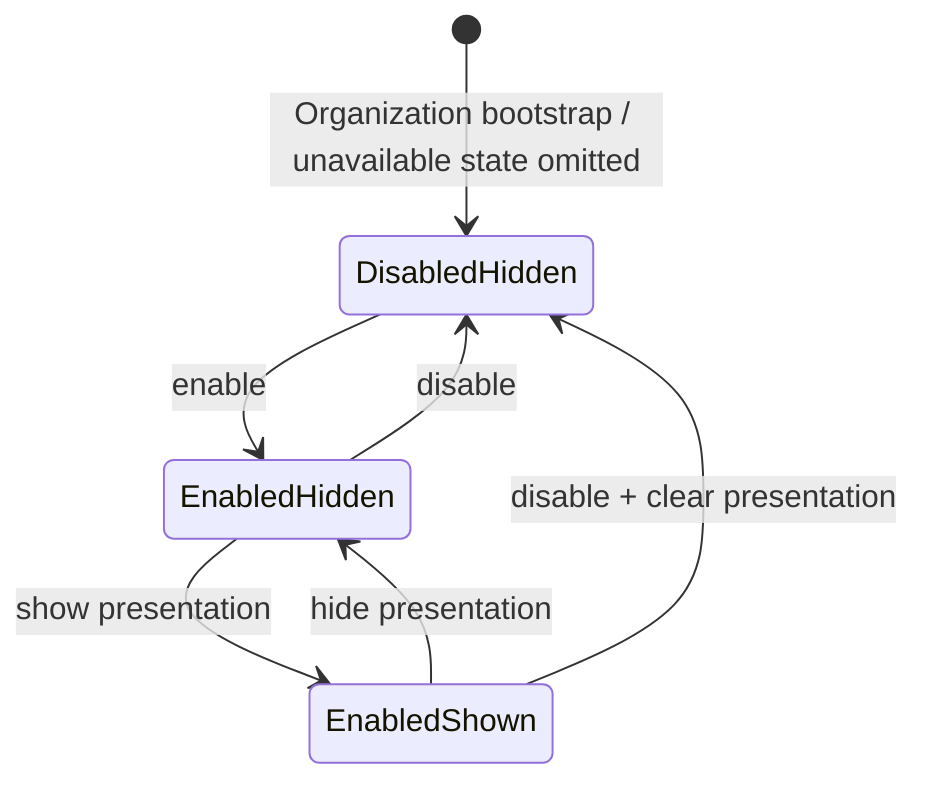

# Storefront Capabilities and First Operator Experience

**Status:** Working draft, 2026-09-11. Target architecture for review only.
This document is not authoritative project documentation, implementation
authority, or evidence of implemented behavior.

## 1. Executive direction

The current Organization bootstrap direction is sufficient with one important
completion: the first Owner must accept an explicit ownership offer using a
normal verified Commerce Architect account. The platform superuser establishes
the Organization and offer; the superuser does not become the merchant and does
not operate the Organization through the business application by default.

The existing state model remains correct:

```text
deployment availability
  → Organization active status
    → Product Commerce enabled
      → Product Commerce presentation shown
        → Product eligible and active
          → public Product Commerce representation
```

Each arrow is an additional requirement, not inheritance or an implied state
change. Actor permission is checked separately for operator actions, and domain
eligibility remains authoritative for each resource and operation.

Product Commerce should own its first presentation control. A separate
storefront-section record is unnecessary now because there is one public
business section and no ordering choice to persist. When Product Commerce is
hidden, the public application keeps its header, brand, and authentication
entry points and omits the complete Products section. It does not request the
public product collection or show an empty-catalog message for a section that
is intentionally absent.

The storefront must nevertheless be composed as a set of eligible sections in
the frontend and public API contract. Product Commerce supplies one section; it
is not the storefront root. The smallest future direction is a hybrid:
capabilities own section types, data validity, permissions, and rendering
contracts, while a storefront-level composition concern eventually owns which
section instances appear and their order. Reserve that seam now; do not create
a generic section schema until a second real section requires it.

The fifteen review questions are answered directly:

1. **Bootstrap:** sufficient after explicit ownership-offer acceptance and
   zero-capability initialization are treated as required semantics.
2. **Capability/presentation:** still correct and independent.
3. **Presentation storage:** capability-specific initially.
4. **Product Commerce section model:** wait; no persisted section concept yet.
5. **Hidden storefront:** retain the shared shell and omit Products entirely.
6. **Capabilities controls:** show availability, enablement, presentation,
   readiness, data presence, public effect, and safe transition explanations.
7. **Ownership of controls:** Products owns records and media; Capabilities owns
   Organization activation and Organization-wide public exposure.
8. **Navigation:** capability state changes availability and explanatory states,
   never actor permission; Products stays reachable for authorized preparation
   when enabled/hidden and for scoped retained-data reading when disabled.
9. **Authorization prerequisites:** verified active identity, current security
   generation, active scoped membership, named permission, Organization state,
   transition validation, recent authentication where selected, and audit.
10. **Avoiding coupling:** render public sections from a storefront description
    rather than mounting `ProductListPage` unconditionally at the application
    root.
11. **Future abstraction:** reserve “Storefront Content” as a capability and a
    small public-section provider contract; no CMS schema now.
12. **Ordering:** future storefront-level composition, with capability-owned
    section behavior and content.
13. **Existing decisions:** all identity, membership, role, Admin, capability,
    ProductImage, and portability decisions remain valid.
14. **Refinements:** public-hidden behavior, first capability controls,
    navigation while disabled, and the future composition seam needed clarity.
15. **Proof slice:** bootstrap one Owner, expose a minimal Organization-scoped
    shell and Product Commerce controls, and conditionally include or omit the
    existing public Products section through backend-enforced state.

## 2. Current UI and runtime reality

The current React application has a restrained top header with the Commerce
Architect name, a development-surface subtitle, and a right-aligned
`Login | Register` action. Authenticated users see their username instead. The
login/register experience opens in a panel below the header and supports
verification and recovery flows. This is a useful interaction direction for the
public storefront. The development subtitle is not durable storefront copy and
will eventually need Organization-aware branding or neutral product wording.

The application currently mounts `ProductListPage` after that shared structure
for every normal route. The page immediately requests `GET /api/products/`, then
renders a Products heading, loading state, error state, empty-catalog message, or
cards. This means Product Commerce is currently the effective storefront body.
An empty response still produces a visible Products section.

The backend endpoint resolves one installation-configured
`STOREFRONT_ORGANIZATION_ID`, requires that Organization to be active, and
returns active physical Products. It has no capability or presentation gate.
The public response also has no storefront composition description. The SPA has
no Organization operator context, membership-aware destination, or operator
shell.

These facts do not contradict the target direction. They identify the smallest
seams to change later: public storefront description before capability data
loading, conditional section rendering, and a separate authenticated operator
route family. The current header and authentication panel can remain shared
presentation components rather than being embedded in Product Commerce.

## 3. First Organization bootstrap-to-Owner journey

The target first-use journey is:

1. An active platform superuser creates an active Organization through a
   narrowly controlled platform bootstrap operation.
2. The Organization has zero enabled business capabilities. A capability newly
   installed later is also disabled for this Organization until deliberately
   enabled.
3. The superuser creates an expiring first-ownership offer for a specific
   normalized email and Organization. The offer grants no active access.
4. The intended Owner registers or signs in through normal Commerce Architect
   authentication, verifies the current email, opens the offer, and explicitly
   accepts it.
5. Acceptance rechecks the Organization, offer, account eligibility, target
   email, and bootstrap authority, then atomically consumes the offer and creates
   or activates the unique Owner membership. The successful bootstrap and its
   actor/provenance are audited.
6. The Owner signs in normally. A valid intended operator destination wins; with
   one accessible Organization the generic operator entry may open it directly;
   with several, the Owner chooses explicitly.
7. The shell opens even though every business capability is disabled. Organization,
   Capabilities, and authorized Team functions do not depend on Product Commerce.
8. Capabilities shows Product Commerce as available and disabled. The Owner can
   enable it after the required authorization and recent-authentication check.
9. Enabling creates or updates Organization capability state and leaves public
   presentation hidden.
10. Products becomes available for authorized catalog preparation. Existing
    records, if this is an adopted deployment, remain Organization-owned and can
    be managed according to policy.
11. The Owner explicitly shows Product Commerce. Only then can the public
    storefront description include its Products section, and only eligible
    active Products appear inside it.
12. Hiding removes the whole public Products section while retaining Product
    records and operator preparation. Disabling also clears presentation to
    hidden and blocks ordinary Product Commerce mutation while preserving data,
    history, and accepted obligations.

This flow does not require Customer, Orders, Payments, Catalog Portability, or a
full Team UI. Bootstrap implementation still needs exact schemas and transaction
contracts, but the target semantics are settled in the existing drafts.

## 4. First operator shell

The four selected areas remain the right initial information architecture:

| Area | First responsibility | Availability rule |
| --- | --- | --- |
| Organization | Organization identity, status, and permitted business settings | Available to every active member through `organization.view`; editing is separately authorized |
| Products | Existing Product records and product-scoped images; later product creation/editing | Visible to actors with Product read permission when Product Commerce is installed; state-specific behavior appears inside the area |
| Capabilities | Business capability activation, readiness, and public exposure | Visible to Owner/Administrator with capability-view permission, even when all capabilities are disabled |
| Team | Membership and invitation operations already assigned to the actor | Visible only with team-view permission; a later self-only membership action need not expose the team directory |

The shell always names the current Organization and makes Organization switching
explicit. Personal account settings remain outside the Organization navigation.
The public-storefront link opens the selected installation storefront only when
the current Organization is that storefront; do not imply that every operator
Organization already has a public hostname.

There is no general dashboard in the first release. The Organization landing
area may contain a small readiness summary derived from data the actor may view,
but it must not become a cross-domain reporting surface. Unsupported Customers,
Orders, Payments, Inventory, Scheduling, or Content areas do not appear as empty
navigation.

## 5. Capability versus presentation model

The following concepts remain separate and are evaluated for different reasons:

| Concept | Meaning | Authority and effect |
| --- | --- | --- |
| Organization active/inactive | Whether normal business operation is available for the Organization at all | Platform lifecycle boundary; broader than any capability |
| Capability installed/available | Whether this deployment contains and supports the capability | Code/deployment capability registry; Organizations cannot enable unavailable code |
| Capability enabled | Whether the Organization may use that business capability | Organization capability state changed by an authorized operator |
| Capability public presentation | Whether the capability contributes its public storefront representation | Capability-specific Organization setting initially; requires enabled capability |
| Resource state | Whether a particular Product or other record is eligible within its domain | Capability-owned domain state such as `Product.is_active` |
| Actor permission | Whether this member may view or change the relevant state | Organization-scoped backend authorization; never inferred from UI visibility |
| Storefront section configuration | Which public sections appear, their instances, order, and limited display configuration | Future storefront-level composition concern; not needed for the first Product section |

For a code-defined available capability, absence of Organization capability
state should mean disabled and presentation hidden. The Capabilities query joins
the deployment registry with Organization state, so a newly installed capability
appears safely as disabled without writing rows for every Organization. Once
configured, retained state and audit history may be stored explicitly. This is
a semantic recommendation; the later schema contract chooses its exact tables.

Product Commerce presentation remains capability-specific in the first release.
This keeps the first controls direct and avoids creating a generic storefront
model before it can express a real composition choice. The public API should
still describe eligible storefront sections, so the frontend does not hard-code
Products as the permanent root.

## 6. Product Commerce first-use state machine



`disabled + shown` is invalid and cannot be persisted. Showing does not enable;
enabling does not show. Disabling from either enabled state writes disabled and
hidden as one consistent transition. Re-enabling returns to enabled/hidden.

| State | Operator behavior | Public behavior |
| --- | --- | --- |
| Disabled/hidden | Capabilities remains manageable; authorized retained-data reads and future export may remain available. Ordinary Product/image/stock mutation, import, and reset are unavailable. | No Products section and no new public Product Commerce activity |
| Enabled/hidden | Authorized catalog preparation, ProductImage work, and product-state changes are available | No Products section and no public Product Commerce entry point |
| Enabled/shown | Same authorized operator catalog behavior | Products section is eligible; it renders only eligible active Products |
| Organization inactive | Normal operator business activity is unavailable apart from account/help and explicit platform recovery | No public business sections |

Resource state remains meaningful while presentation is hidden. `Product.is_active`
answers whether a Product is eligible when its public capability is shown; it
does not publish the Product by itself. Hiding or disabling must not rewrite all
Product flags. Likewise, showing an empty eligible catalog may render the
Product section's honest empty state, because the operator deliberately exposed
that capability. This differs from hidden presentation, where the entire section
is absent.

Accepted commercial obligations continue under their owning domain rules after
hide or disable. A cart or unaccepted checkout must recheck current capability,
presentation, Product, and domain eligibility before commitment. Those future
rules do not block this state model and are not implemented by it.

## 7. Public storefront behavior

The public storefront is a shell plus zero or more eligible public sections. Its
shared shell contains brand/header structure, account entry points, and any
future Organization-level public identity that is independent of Product
Commerce.

When Product Commerce presentation is hidden:

- keep the current header/banner direction and Login/Register behavior;
- omit the Products heading, loading state, grid, empty state, and product API
  request;
- do not replace the missing section with “Products are disabled,” setup advice,
  or fake promotional content;
- render any other eligible future storefront sections normally;
- if there are no sections, render a clean shell/body with no business-section
  placeholder. A later product decision may add Organization-level welcome copy,
  but Product Commerce must not supply it.

When Product Commerce is shown, the existing product-list structure can remain
the first implementation of that section. Loading, error, empty, and card states
belong inside the shown Product Commerce section. The backend enforces exposure;
hiding a component alone is insufficient.

A minimal public storefront-description response should disclose only public
presentation facts, such as an ordered list of public section descriptors. It
should not expose operator permissions, disabled capabilities, readiness errors,
internal dependencies, or retained-data counts. The first response can return
either no sections or one `product_commerce` section in a fixed default position.
Its exact endpoint and representation belong to the implementation contract.

## 8. Initial Capabilities operator experience

The Capabilities area is a business-configuration surface, not a deployment
feature-flag console. The first Product Commerce entry should communicate:

- the human name and a short explanation of the business capability;
- whether it is available in this deployment;
- whether the Organization has enabled it;
- whether its public presentation is hidden or shown;
- what the current transition will change and preserve;
- readiness or dependency blockers relevant to the requested transition;
- whether retained Product data exists, using a bounded count or simple
  `contains data` indicator only when the actor may view catalog data;
- whether the public storefront is currently exposing the Products section.

Controls follow the state instead of presenting two unconstrained toggles:

| Current state | Primary controls | Explanation |
| --- | --- | --- |
| Unavailable | No mutation control | This installation does not currently provide Product Commerce |
| Disabled/hidden | Enable | Enables catalog operation; public Products remains hidden |
| Enabled/hidden | Show on storefront; Disable | Show exposes eligible active Products. Disable preserves data and remains hidden on re-enable |
| Enabled/shown | Hide from storefront; Disable | Hide removes only public presentation. Disable also hides and stops ordinary capability operation |

Disable requires a consequence summary and explicit confirmation because it
stops ordinary business operations. Hide is lower impact but still changes the
public site and requires the selected recent-authentication policy. Readiness is
evaluated by the backend at transition time; stale frontend readiness cannot
authorize a state change.

“Contains data” is advisory. It never changes authorization or implies that
disabling deletes records. A future dependency list should use business terms
and actionable states rather than database table names or environment flags.

## 9. Authorization implications

The first capability controls require these backend decisions before exposure:

1. Resolve a valid active User with verified current email and current account
   security generation.
2. Resolve the explicit active Organization and active OrganizationMembership;
   confirm the Organization satisfies the selected owner-governance invariant.
3. Require `organization.capabilities.view` to read the operator capability
   state and `organization.capabilities.manage` for enable/disable. Initially
   that management grant targets Product Commerce only.
4. Require `product_commerce.presentation.manage` for show/hide. Owner and
   Administrator receive it; Manager and Staff do not.
5. Require the selected recent credential authentication for capability and
   public-exposure changes. It adds no permission.
6. Validate installed availability, current state, allowed transition,
   readiness, and Organization scope again inside the mutation boundary.
7. Commit the state change and successful audit event atomically, including
   actor, Organization, old/new state, operation identifier, and outcome.
8. Re-evaluate public state on the backend. Frontend navigation or cached public
   descriptions cannot make a disabled or hidden capability visible.

Products authorization remains separate. `product_commerce.products.view`
governs catalog reading; `products.edit` and `images.manage` govern their own
mutations. A person who can edit Products cannot expose them Organization-wide.
A person who can manage exposure does not automatically receive catalog data if
their role mapping later changes.

When Product Commerce is disabled, Products may remain in navigation for an
actor with catalog-read permission. The area becomes a retained-data view with a
clear disabled-state explanation and a Capabilities link only if the actor may
manage capabilities. Mutation controls are absent or disabled based on the
backend policy response. When enabled/hidden, Products supports preparation.
When enabled/shown, it may indicate that eligible edits affect the live public
section. Capability state shapes allowed operations; it does not grant them.

Catalog Portability is not a prerequisite. Future browser import/export/reset
fits this same Organization + membership + capability + named-operation policy,
while trusted CLI authority remains an installation boundary.

## 10. Storefront composition boundary

Three small architectural options are reasonable:

| Option | Benefit | Cost / failure mode |
| --- | --- | --- |
| Capability-owned presentation only | Smallest first implementation | Once several capabilities contribute sections, no single owner controls cross-capability order or repeated instances |
| Storefront owns every content type and rendering rule | Central ordering is simple | Creates a generic page-builder/CMS core too early and weakens domain ownership |
| Hybrid: capability providers plus storefront composition | Capabilities retain rules; storefront can later order heterogeneous sections | Requires a small shared contract when the second section arrives |

Select the hybrid as the target seam, while implementing capability-owned
presentation only for Product Commerce now. A capability can declare a stable
public section type and produce its safe public representation. A future
storefront composition model selects permitted section instances, limited
presentation configuration, and order for one Organization storefront.

The storefront layer must not reach into arbitrary capability tables or decide
Product eligibility. A capability must not independently assign a global order
relative to unknown capabilities. The shared contract should eventually cover
only stable section identity/type, public payload, eligibility, and bounded
configuration validation. Authentication, editor workflows, rich content
schemas, and revision histories do not belong in that contract.

For the first release, the composition algorithm is deliberately trivial:

```text
if Product Commerce is installed + Organization active + enabled + shown:
    include the Product Commerce section in the fixed first/default position
else:
    include no Product Commerce section
```

This can later be adapted behind the same public storefront-description boundary
without changing Product records or making the React application root synonymous
with a product grid.

## 11. Future Storefront Content direction

Reserve the product name **Storefront Content** for a possible future business
capability. “Content & Media” risks confusion with ProductImage storage and a
general digital-asset manager. Storefront Content would own authored public
content and its operator permissions; immutable ProductImage remains catalog
media unless deliberately generalized later.

The first credible Storefront Content release could provide a small allowlist of
section types such as heading/copy, image/copy, promotional block, video or
livestream embed, and article/event cards or feeds. Each concrete type would
have typed validation and safe rendering. External embeds require an explicit
provider allowlist and security/privacy review; they are not arbitrary HTML.

Do not select its database schema now. Reserve these boundaries only:

- Storefront Content is independently installed and enabled per Organization.
- Its operators receive explicit content permissions distinct from Product
  Commerce and Organization-wide composition authority.
- It can provide one or more validated public section instances.
- The future storefront composition layer owns placement and order across
  Product Commerce, Storefront Content, service commerce, events, and other
  providers.
- Disabling one capability removes its public contributions without deleting
  retained content or rearranging unrelated section identities unexpectedly.

The second real public section should trigger the concrete StorefrontSection
design. At that point, decide cardinality, stable identities, ordering,
capability dependency behavior, deletion/retention, and migration of the current
fixed Product Commerce position. Until then, a conceptual provider contract and
conditional section renderer are enough.

## 12. Explicit non-goals

This refinement does not design or authorize:

- a CMS, generic page builder, WYSIWYG editor, arbitrary HTML, or theme system;
- content revisions, publishing workflow, scheduled publication, editorial
  approval, localization, taxonomy, categories, or search;
- a plugin framework or runtime-discovered arbitrary capability code;
- persisted generic storefront sections or drag-and-drop ordering in the first
  Product Commerce slice;
- private draft ProductImage delivery, a media library, DAM, transformations, or
  media garbage collection;
- Customer, Orders, Payments, Inventory, Scheduling, or Team implementation;
- public multi-store routing, custom domains, or an Organization storefront
  discovery system;
- Catalog Portability T12 or later work, browser import/export/reset, or changes
  to trusted CLI authority;
- application code, migrations, API endpoints, or frontend behavior in this
  architecture exercise.

## 13. Minimum first implementation slice

The smallest slice that proves the refined architecture is one end-to-end
bootstrap and Product Commerce visibility journey:

1. Add the minimum membership/Owner, bootstrap-offer, fixed-permission,
   Organization capability-state, recent-authentication, and audit foundations
   required by the selected policies.
2. Provide a trusted superuser bootstrap operation that creates an Organization
   with zero enabled capabilities and establishes the first accepted Owner.
3. Add an authenticated Organization-context endpoint and minimal operator shell
   with Organization and Capabilities. Products can link to the existing catalog
   context; Team implementation is not required to prove capability control.
4. Add Product Commerce enable/disable and show/hide transitions with backend
   enforcement, explicit explanations, and audit.
5. Add a public storefront-description boundary and conditionally render the
   existing Products section. Hidden/disabled means no product request or
   section; enabled/shown preserves its current loading/error/empty/card behavior.
6. Prove the complete transition: new active Organization → accepted Owner →
   disabled/hidden → enabled/hidden → enabled/shown → hidden → disabled/hidden.

This is larger than a database-only capability toggle because a toggle alone
does not prove authorization or public enforcement. It is smaller than the full
first shell: ProductImage upload, Team management, Product CRUD, multi-Organization
public routing, generic section ordering, and portability remain later slices.

## 14. Open questions requiring human or product input

These questions can remain explicit without blocking an implementation-planning
prompt for the proof slice:

| Question | Why it cannot be inferred | Safe proof-slice default |
| --- | --- | --- |
| What Organization-level public copy appears when no sections are shown? | Brand/content choice | Clean shared shell with no fabricated business copy |
| Should an intentionally shown but empty Product Commerce section display the current empty message? | Product presentation choice | Yes; exposure is deliberate and the empty state is honest |
| Does the existing storefront Organization have to remain publicly shown during migration? | Deployment/data fact | Require an explicit backfill decision; never apply the new default blindly |
| Must capability disable be blocked when accepted obligations exist, or may servicing exceptions suffice? | Future Orders/business policy | No Orders dependency in the proof slice; retain the explicit future obligation rule |
| Does every deployed Organization eventually have its own public storefront/domain? | Product topology decision | Keep the single configured public storefront and independent multi-Organization operator scope |
| Who may manage future cross-capability section order? | Future role/business duty | Defer; do not treat Product presentation permission as generic composition authority |
| Which first non-product section should trigger Storefront Content design? | Requires an actual adopter use case | No schema until one concrete section is selected |

Existing broader human-policy questions about ownership recovery, MFA recovery,
support-data access, audit retention, and staff job fit remain in the parent
operator draft. They do not change this storefront model.

## 15. Recommended implementation sequencing

Each item requires a separate implementation contract and authorization:

1. **Foundation contract:** membership/Owner bootstrap, fixed permission checks,
   current operator eligibility, recent authentication, capability-state
   semantics, audit, transaction ordering, and explicit existing-storefront
   backfill.
2. **Bootstrap and context:** superuser Organization/Owner bootstrap, ownership
   acceptance, access-context resolution, and minimal operator route shell.
3. **Capability transitions:** Product Commerce status/readiness query and
   enable/disable/show/hide operations in the Capabilities area.
4. **Public enforcement:** public storefront description and conditional Product
   Commerce section rendering, preserving the current header/auth behavior.
5. **Product preparation:** complete operator Product reads/edits and the selected
   ProductImage workflow under enabled/hidden state.
6. **Team workflow:** invitations, membership status, permitted role changes,
   and ownership governance once stronger-authentication dependencies are ready.
7. **Later adapters:** separately authorized Catalog Portability browser exposure
   and the first concrete Storefront Content section. Design persisted storefront
   composition only when the second public section creates a real ordering need.

After this refinement, the operator architecture is ready for a separate,
bounded implementation-planning prompt for steps 1–4. It is not implementation
authority, and none of those steps is performed by this document.
